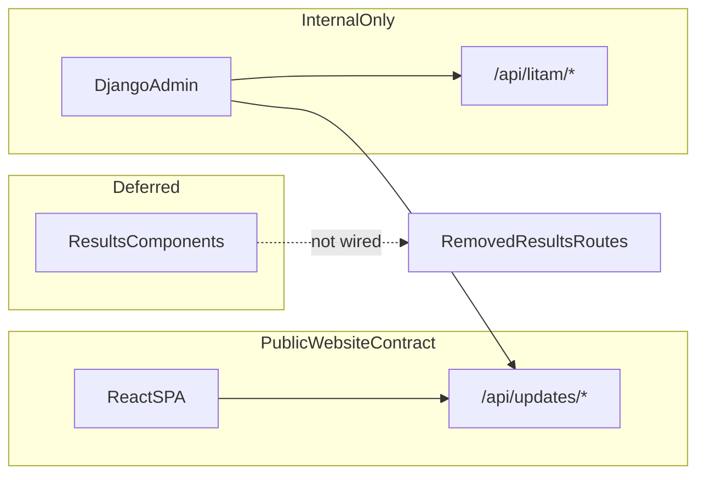
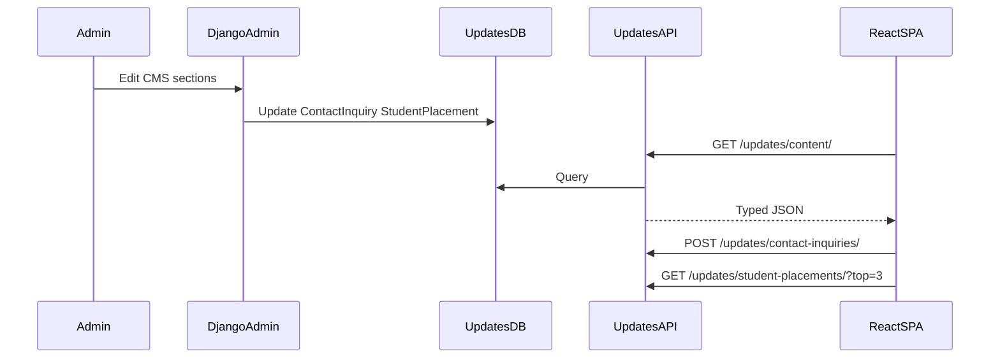

# Backend–Frontend Coordination Plan (CMS-first + Defer Results)

## Architecture decision

**Public website contract:** only [`backend/backend/updates/`](backend/backend/updates/) endpoints under `/api/updates/`.

**Internal / admin-only:** [`backend/backend/litam/`](backend/backend/litam/) stays for Django Admin, seed data, and future staff tools — not consumed by the React site.

**Deferred:** Results PDF pipeline stays out of scope; remove broken backend references only. Keep [`frontend/src/components/Results/`](frontend/src/components/Results/) unmounted.



## Target public API (single source of truth)

| Method | Path | Purpose | Frontend consumer |
|--------|------|---------|-------------------|
| GET | `/api/updates/content/` | All CMS sections keyed by section name | Home, Campus |
| GET | `/api/updates/` | Updates feed | [`UpdatesPage.tsx`](frontend/src/UpdatesPage.tsx) |
| GET | `/api/updates/student-placements/?top=N` | Student placement cards | Home, [`PlacementsPage.tsx`](frontend/src/PlacementsPage.tsx) |
| POST | `/api/updates/contact-inquiries/` | Contact form | Home contact section |

Section-specific routes (`/notices/`, `/events/`, etc.) remain available but the SPA should prefer `/content/` to avoid duplicate fetches.

## Phase 1 — Stop the bleeding (must ship first)

### 1.1 Remove broken `results` references (defer, not restore)

In [`backend/backend/backend/settings.py`](backend/backend/backend/settings.py):
- Remove `'results'` from `INSTALLED_APPS`

In [`backend/backend/backend/urls.py`](backend/backend/backend/urls.py):
- Remove `path('api/results/', include('results.urls'))`

This unblocks Django startup. Celery worker in [`docker-compose.yml`](docker-compose.yml) can stay for now but has no active tasks until Results is restored later.

### 1.2 Fix frontend API paths and schema mismatches

Centralize all HTTP calls in [`frontend/src/api.ts`](frontend/src/api.ts) and stop calling axios directly from [`App.tsx`](frontend/src/App.tsx).

| Current (broken) | Correct |
|------------------|---------|
| `GET /content/` | `GET /updates/content/` |
| `GET /courses/` | Remove — use CMS `content.course` from `/updates/content/` |
| `GET /litam/placements/` | `GET /updates/student-placements/?top=N` |
| `GET /litam/courses/` in `fetchCourses()` | Remove unused export |

Backend already supports `?top=` in [`StudentPlacementListAPIView`](backend/backend/updates/views.py):

```python
top = self.request.query_params.get('top')
queryset = queryset[:top]
```

Refactor `api.ts` to expose typed helpers:

```ts
fetchSiteContent()      // GET /updates/content/
fetchUpdates()          // GET /updates/
fetchStudentPlacements(top?: number)
submitContactInquiry(data)
```

Update consumers:
- [`App.tsx`](frontend/src/App.tsx): replace inline `api.get("/content/")`, remove Academics `api.get('/courses/')`, use `fetchStudentPlacements(3)`
- [`UpdatesPage.tsx`](frontend/src/UpdatesPage.tsx): use `fetchUpdates()`
- [`PlacementsPage.tsx`](frontend/src/PlacementsPage.tsx): use `fetchStudentPlacements()`

**Academics section rule (CMS-first):** render courses from `content.course` first, then static `courseCategories` fallback. Do not call `litam` course API or a separate courses endpoint — CMS `Update` rows (`title`, `message`, `image`) are the website source of truth.

### 1.3 Align environment config

Fix [`.env.example`](frontend/.env.example) to match code:

```env
VITE_API_URL=http://127.0.0.1:8000
```

(`api.ts` appends `/api` itself; do not include `/api` in the env var.)

Add localhost to backend CORS in [`settings.py`](backend/backend/backend/settings.py):

```python
CORS_ALLOWED_ORIGINS = [
    "https://litam.vercel.app",
    "http://127.0.0.1:4174",
    "http://localhost:4174",
]
```

## Phase 2 — Shared contract (same dev tech: TypeScript + OpenAPI)

Add **drf-spectacular** to Django to publish OpenAPI at `/api/schema/` and Swagger UI at `/api/docs/`.

Scope the schema to **public endpoints only** (`updates` views), so generated types match what the SPA actually uses.

Add a root-level type generation step:

```json
// package.json (new root script)
"generate:api-types": "openapi-typescript http://127.0.0.1:8000/api/schema/ -o frontend/src/types/api.generated.ts"
```

Create [`frontend/src/types/api.ts`](frontend/src/types/api.ts) with hand-written aliases for the CMS payload shape:

```ts
export type SiteContent = Record<
  'hero' | 'notice' | 'event' | 'course' | 'placement' | 'recruiter' |
  'gallery' | 'faculty' | 'testimonial' | 'student_life' | 'about' |
  'stats' | 'unique_feature' | 'campus',
  UpdateItem[]
>;
```

Wire `api.ts` return types to these interfaces so components get compile-time checks.

## Phase 3 — Developer workflow (one coordinated loop)

Add a root [`package.json`](package.json) orchestration script (using `concurrently`):

```json
{
  "scripts": {
    "dev": "concurrently \"npm run dev:api\" \"npm run dev:web\"",
    "dev:api": "cd backend/backend && python manage.py runserver",
    "dev:web": "cd frontend && npm run dev",
    "generate:api-types": "openapi-typescript http://127.0.0.1:8000/api/schema/ -o frontend/src/types/api.generated.ts"
  }
}
```

Document the loop in a short [`docs/API_CONTRACT.md`](docs/API_CONTRACT.md):
- Public vs internal endpoints
- How admins edit CMS content
- How to regenerate TS types after serializer changes
- Env vars for local vs production

## Phase 4 — Guardrails (prevent drift)

### Backend integration tests

Add tests in [`backend/backend/updates/tests.py`](backend/backend/updates/tests.py) asserting:
- `GET /api/updates/content/` returns all section keys
- `GET /api/updates/student-placements/?top=3` returns at most 3 items
- `POST /api/updates/contact-inquiries/` validates required fields

### Frontend contract smoke checks

Add lightweight tests or a dev-only script that verifies `api.ts` paths match OpenAPI paths (can be a CI grep check initially).

### Mark deferred Results clearly

Add a short comment block at top of [`frontend/src/components/Results/`](frontend/src/components/Results/) and in `docs/API_CONTRACT.md`:

> Results feature deferred. Components intentionally not routed. Restore requires re-adding `results` app + Celery task + routes.

Do **not** delete Results components now (defer, not remove).

## Phase 5 — Clarify `litam` role (no frontend usage)

Keep `/api/litam/*` mounted for admin/seed/future staff tools, but:
- Remove all frontend imports/calls to `/litam/*`
- Delete stale helper [`frontend/src/update_app.py`](frontend/src/update_app.py) (one-off path rewrite script)
- Document in `API_CONTRACT.md` that `litam.Inquiry` is separate from public `ContactInquiry`

Optional later (not in this pass): move `litam` routes under `/api/internal/litam/` to make the boundary obvious.

## Expected outcome

After implementation:



- Home, Updates, Placements, Campus, and Contact work against one API namespace
- Django starts without missing `results` app
- TypeScript types reflect backend serializers
- `litam` and Results do not leak into the public site path
- Local dev runs with one command and matching CORS/env

## Implementation order

1. Remove `results` from settings/urls (backend boots)
2. Refactor `api.ts` + fix all frontend call sites
3. Fix CORS + `.env.example`
4. Add drf-spectacular + generate TS types
5. Add integration tests + `API_CONTRACT.md`
6. Add root dev scripts

## Out of scope (explicitly deferred)

- Restoring Results PDF upload / hall-ticket lookup
- JWT auth for SPA
- Migrating CMS data into `litam` structured models
- Adding course category tabs to CMS (future: optional `category` field on `Update` for `section=course`)
